---
# try also 'default' to start simple
theme: ./theme
# random image from a curated Unsplash collection by Anthony
# like them? see https://unsplash.com/collections/94734566/slidev
background: https://cover.sli.dev
# some information about your slides (markdown enabled)
title: 匀变速直线运动实例
info: |
  ## Slidev Starter Template
  Presentation slides for developers.

  Learn more at [Sli.dev](https://sli.dev)
# apply UnoCSS classes to the current slide
class: text-center
# https://sli.dev/features/drawing
drawings:
  persist: false
# slide transition: https://sli.dev/guide/animations.html#slide-transitions
transition: slide-left
# enable MDC Syntax: https://sli.dev/features/mdc
mdc: true
hideInToc: true
dragPos:
  square: Left,Top,Width,Height,Rotate
---

---
layout: cover
titleZh: 摩擦分析
session: Autumn-7
date: 25.10.25
teacher: 田以恒
---

---
hideInToc: true
---

# 目录Content

<Toc minDepth="1" maxDepth="3" />

---
title: 摩擦力大小的计算
layout: two-cols-header
transition: fade-out
---

# 摩擦力大小的计算
::left::
## 静摩擦力
> 被动力：无法独立确定 (弹力也是)
> $\textbf{\color{crimson}{没有可以直接用来定量计算的公式}}$

- 静摩擦力大小取值范围: $0<f_s\le f_{smax}$
> $f_s$ 是静摩擦力，$f_{smax}$ 是最大静摩擦力
- 根据**运动状态法**间接计算静摩擦力大小.

::right::
## 动摩擦力
> 主动力：可以独立确定
> eg.重力 $G=mg$，空气阻力 $f=kv$，电场力 $F=Eq$

- $f_k=\mu N$
> $f_k$ 是动摩擦力，$\mu$ 是动摩擦系数，$N$ 是接触面之间的正压力
- 也可以根据**运动状态法**间接计算动摩擦力大小

---
title: 运动状态法
layout: two-cols-header
level: 2
dragPos:
  square1: 52,158,165,130
  square2: 488,159,165,130
---

# 运动状态法
>对于无法求解的力，间接地求出其大小和方向

::left::
## 静止

     

- 求A 受静摩擦力 $f_S$ 大小.
<Solution src="/files/1.md" maxHeight="15vh" />
- 若外力 $F$ 增大，$f_s$ 是否增大？

::right::
## 匀速下滑

     

- 求 A 受动摩擦力 $f_k$ 大小.
<Solution src="/files/1.md" maxHeight="15vh" />
- 若 A 不匀速下滑，$f_k$ 是否不变？

---
title: 运动状态法的数学本质
level: 2
dragPos:
  square1: 636,143,246,194
---

# 运动状态法的数学本质
> 由运动判断力

1.已知一个物体的**运动**状态：  静止和匀速|匀加速  
2.可以判断其所受合**力** $F=0或F=ma$  
3.再对物体进行受力分析:  
$$F+N+G+f=F_合$$
4.分析已知量，求出**未知**量

---
transition: fade-out
title: 题1-1
level: 3
hideInToc: true
dragPos:
  square1: 55,8,707,242
---

---
transition: fade-out
title: 题1-2
hideInToc: true
level: 3
dragPos:
  square1: 55,8,658,254
---

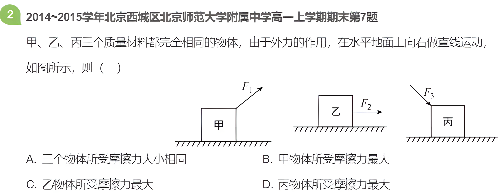

---
transition: fade-out
title: 题1-3
hideInToc: true
level: 3
dragPos:
  square1: 55,8,578,261
---

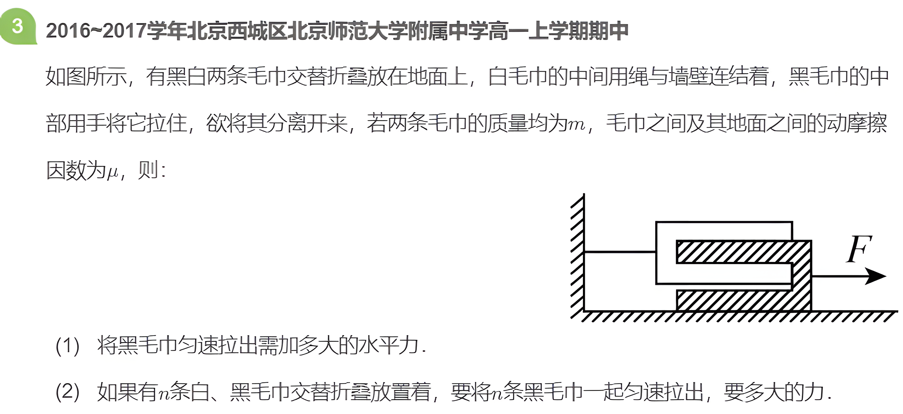

---
title: 摩擦力的有无及方向的判定
layout: two-cols-header
transition: fade-out
---

<Toc mode="onlyCurrentTree" minDepth="1" maxDepth="3" />

---
title: 摩擦力基础
transition: fade-out
level: 2
dragPos:
  square1: 114,91,663,369
---

# 摩擦力基础知识

---
title: 滑动摩擦力:相对运动法
layout: two-cols-header
transition: fade-out
level: 2
dragPos:
  square1: 614,29,286,138
---

# 滑动摩擦力:相对运动法

::left::
## 相对运动法
A受滑动摩擦力是由A相对B的运动造成的，  
所以从定义出发，判断滑动摩擦力的方向  
>1.判断A相对B速度关系  
>2.判断A相对B运动方向  
>3.判断A受B的$f_k$方向
::right::
## 举个例子：
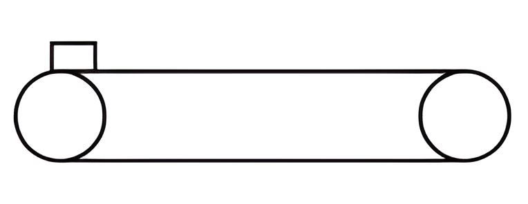
 

讨论以下三种情况下，物块A受$f_k$的方向.
- $v_2=v_1$  
- $v_2>v_1$
- $v_2<v_1$

---
transition: fade-out
title: 题2-1
hideInToc: true
level: 3
dragPos:
  square1: 55,8,681,382
---

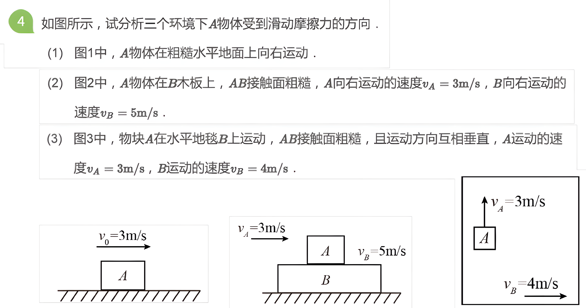

---
transition: fade-out
title: 题2-2
hideInToc: true
level: 3
dragPos:
  square1: 55,8,798,428
---

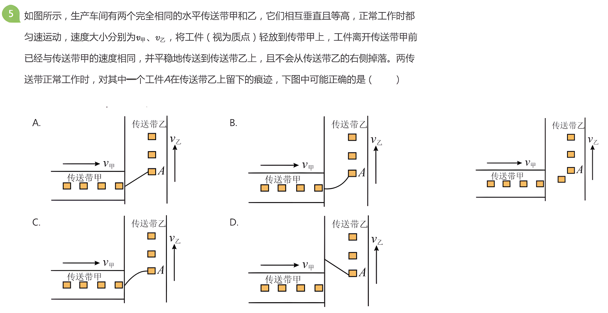

---
transition: fade-out
title: 题2-3
hideInToc: true
level: 3
dragPos:
  square1: 55,8,651,226
---

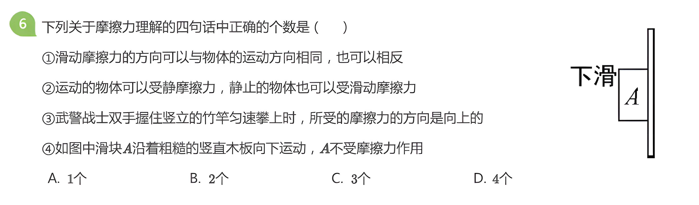

---
title: 总结：对相对运动的理解
transition: fade-out
hideInToc: true
level: 2
dragPos:
  square1: 614,29,286,138
---

# 总结：对相对运动的理解
摩擦力的方向总是与物体间相对运动(或相对运动趋势)的方向相反，  
与物体的运动方向_________。
>1.摩擦力既可以是阻力，也可以是动力。  
>2.受静摩擦力作用的物体不一定静止，受滑动摩擦力作用的物体不一定运动。 

---
title: 静摩擦力
transition: fade-out
level: 2
dragPos:
  square1: 31,136,608,275
---

# 静摩擦力的方向判断
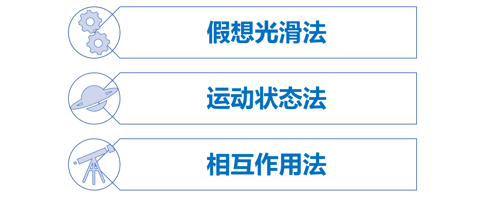

---
title: 假想光滑法
transition: fade-out
level: 3
dragPos:
  square1: 31,136,614,216
---

# 假想光滑法
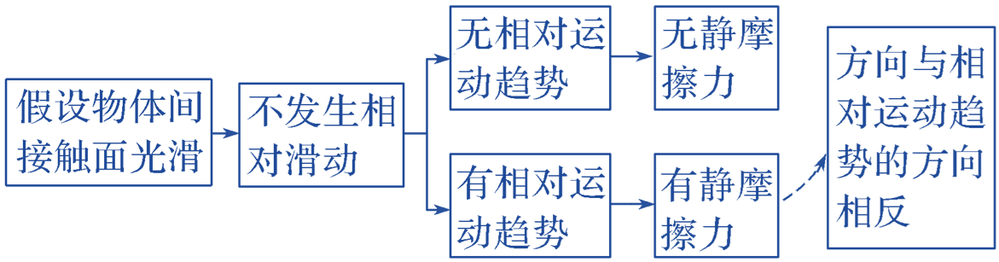

---
transition: fade-out
title: 题3-1
hideInToc: true
level: 3
dragPos:
  square1: 37,5,756,340
---

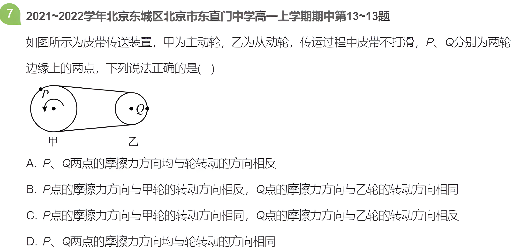

---
title: 运动状态法
transition: fade-out
level: 3
---
# 运动状态法  
处于静止或匀速直线运动的物体，利用**平衡条件**确定静摩擦力的有无及方向。

---
transition: fade-out
title: 题3-2
hideInToc: true
level: 3
dragPos:
  square1: 37,5,741,270
---

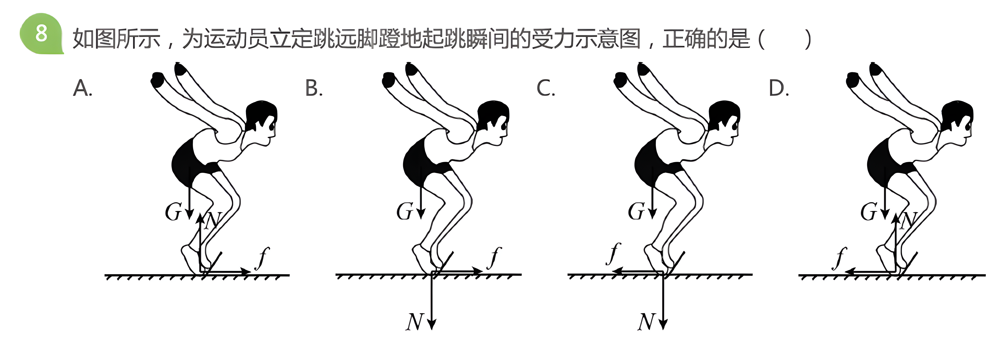

---
title: 相互作用法
transition: fade-out
level: 3
---
# 相互作用法
“力是物体间的相互作用”，先确定受力较少的物体是否受到静摩擦力并判断方向，再根据**牛顿第三定律**确定另一物体是否受到静摩擦力及方向。

---
transition: fade-out
title: 题3-3
hideInToc: true
level: 3
dragPos:
  square1: 37,5,743,313
---

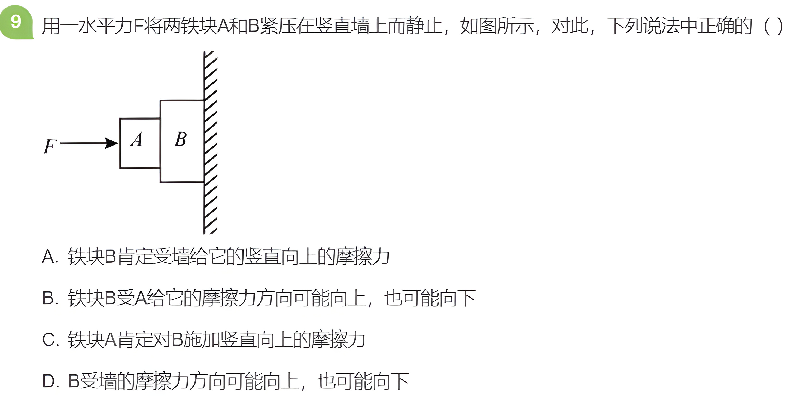

---
title: 摩擦力突变
layout: two-cols-header
transition: fade-out
dragPos:
  square1: 379,75,436,339
---

# 摩擦力突变
<Toc mode="onlyCurrentTree" minDepth="1" maxDepth="3" />

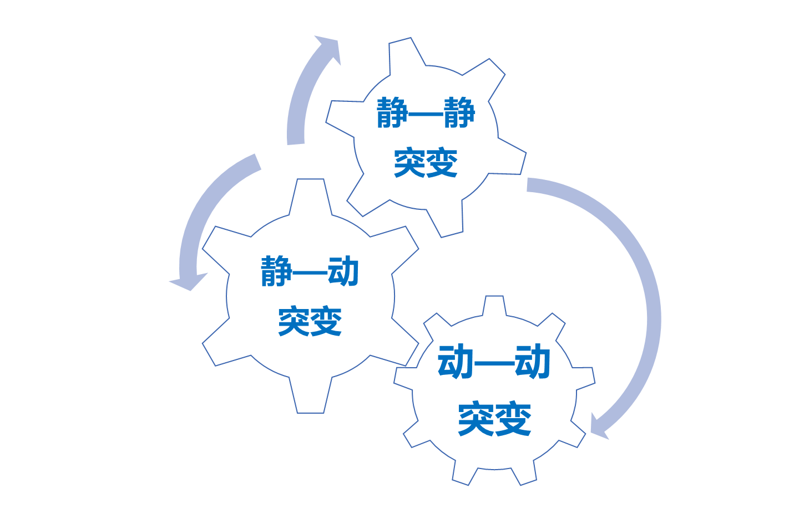

---
title: 静静突变
transition: fade-out
level: 3
dragPos:
  square1: 44,139,718,224
---

# 静静突变
物体在静摩擦力和其他力的共同作用下处于静止状态，当作用在物体上的其他力的合力发生变化时，如果物体仍然保持静止状态，则物体受到的静摩擦力的大小和方向将发生突变。

---
transition: fade-out
title: 题4-1
hideInToc: true
level: 3
dragPos:
  square1: 9,4,751,268
---

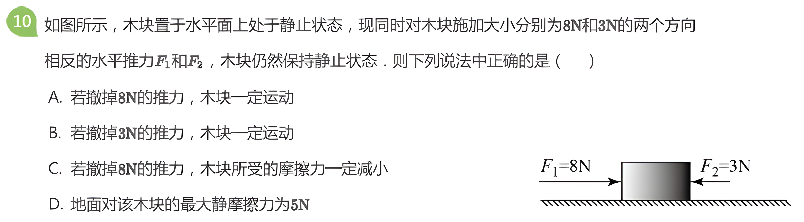

---
transition: fade-out
title: 题4-2
hideInToc: true
level: 3
dragPos:
  square1: 13,15,734,331
---

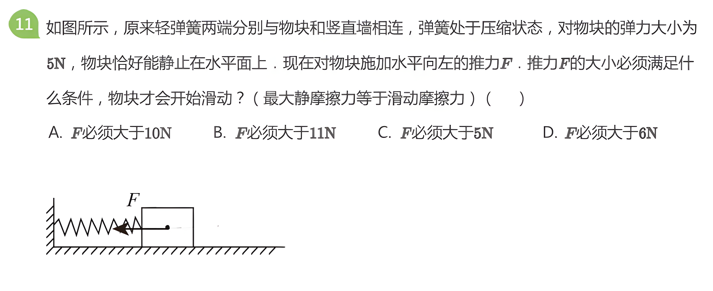

---
transition: fade-out
title: 题4-3
hideInToc: true
level: 3
dragPos:
  square1: 24,27,779,299
---

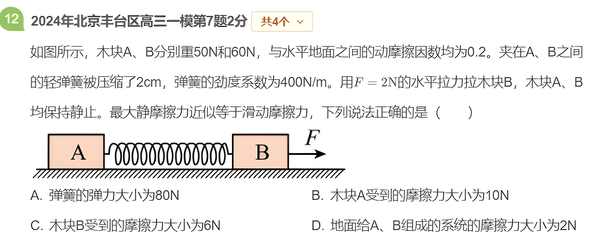

---
title: 静动突变
transition: fade-out
level: 2
dragPos:
  square1: 31,136,614,216
---
# 静动突变
## 由静变动：  
物体在静摩擦力和其他力作用下处于相对静止状态，当其他力变化时，如果物体不能保持相对静止状态，则物体受到的静摩擦力将“突变”成滑动摩擦力.  
## 由动变静：  
或在滑动摩擦力和其他力作用下，做减速运动的物体突然停止滑行时，物体将不再受滑动摩擦力作用，滑动摩擦力“突变”为静摩擦力。  

---
transition: fade-out
title: 题4-4
hideInToc: true
level: 3
dragPos:
  square1: 9,14,755,423
---

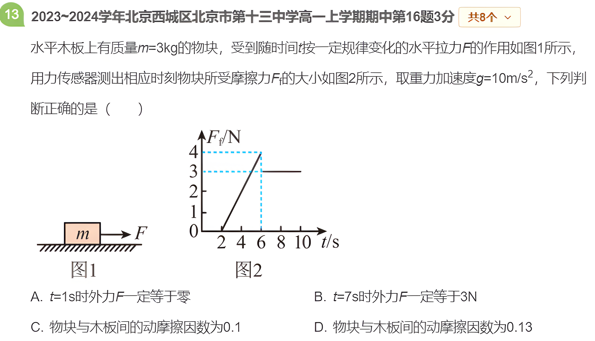

---
transition: fade-out
title: 题4-5
hideInToc: true
level: 3
dragPos:
  square1: 24,3,735,487
---

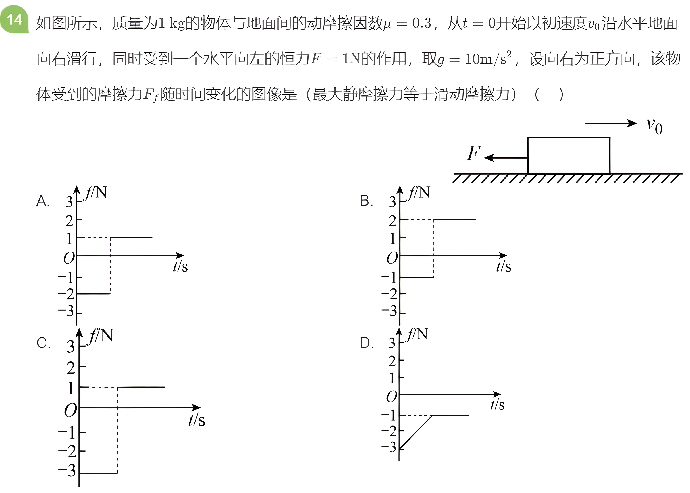

---
title: 动动突变
transition: fade-out
level: 2
dragPos:
  square1: 31,136,614,216
---
# 动动突变
在滑动摩擦力作用下运动至达到共同速度后，如果在静摩擦力作用下不能保持相对静止，则物体将受滑动摩擦力作用，且其方向发生反向。

---
transition: fade-out
title: 题4-6
hideInToc: true
level: 3
dragPos:
  square1: 5,-2,741,337
---

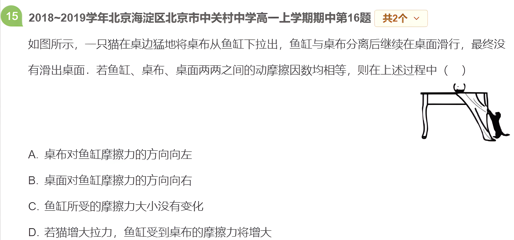

---
layout: cover
titleZh: 摩擦分析
session: Autumn-7
date: 25.10.25
teacher: 田以恒
---

---
hideInToc: true
---

# 目录Content

<Toc minDepth="1" maxDepth="3" />
