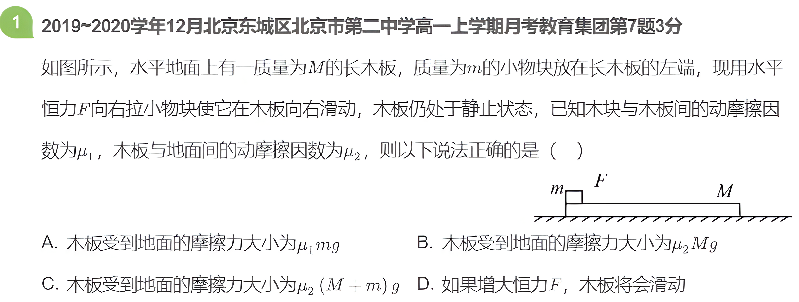

---
# try also 'default' to start simple
theme: ./theme
# random image from a curated Unsplash collection by Anthony
# like them? see https://unsplash.com/collections/94734566/slidev
background: https://cover.sli.dev
# some information about your slides (markdown enabled)
title: 匀变速直线运动实例
info: |
  ## Slidev Starter Template
  Presentation slides for developers.

  Learn more at [Sli.dev](https://sli.dev)
# apply UnoCSS classes to the current slide
class: text-center
# https://sli.dev/features/drawing
drawings:
  persist: false
# slide transition: https://sli.dev/guide/animations.html#slide-transitions
transition: slide-left
# enable MDC Syntax: https://sli.dev/features/mdc
mdc: true
hideInToc: true
dragPos:
  square: Left,Top,Width,Height,Rotate
---

---
layout: cover
titleZh: 摩擦分析
session: Autumn-7
date: 25.10.25
teacher: 田以恒
---

---
hideInToc: true
---

# 目录Content

<Toc minDepth="1" maxDepth="2" />

---
layout: two-cols-header
transition: fade-out
---

# 摩擦力大小的计算
::left::
## 静摩擦力
> 被动力：无法独立确定 (弹力也是)
> $\textbf{\color{crimson}{没有可以直接用来定量计算的公式}}$

- 静摩擦力大小取值范围: $0<f_s\le f_{smax}$
> $f_s$ 是静摩擦力，$f_{smax}$ 是最大静摩擦力
- 根据**运动状态法**间接计算静摩擦力大小.

::right::
## 动摩擦力
> 主动力：可以独立确定
> eg.重力 $G=mg$，空气阻力 $f=kv$，电场力 $F=Eq$

- $f_k=\mu N$
> $f_k$ 是动摩擦力，$\mu$ 是动摩擦系数，$N$ 是接触面之间的正压力
- 也可以根据**运动状态法**间接计算动摩擦力大小

---
layout: two-cols-header
level: 2
dragPos:
  square1: 52,158,165,130
  square2: 488,159,165,130
---

# 运动状态法
>对于无法求解的力，间接地求出其大小和方向

::left::
## 静止

     

- 求A 受静摩擦力 $f_S$ 大小.
<Solution src="/files/1.md" maxHeight="15vh" />
- 若外力 $F$ 增大，$f_s$ 是否增大？

::right::
## 匀速下滑

     

- 求 A 受动摩擦力 $f_k$ 大小.
<Solution src="/files/1.md" maxHeight="15vh" />
- 若 A 不匀速下滑，$f_k$ 是否不变？

---
title: 推论法
level: 2
dragPos:
  square1: 636,143,246,194
---

# 运动状态法的数学本质
> 由运动判断力

1.已知一个物体的**运动**状态：  静止和匀速|匀加速  
2.可以判断其所受合**力** $F=0或F=ma$  
3.再对物体进行受力分析:  
$$F+N+G+f=F_合$$
4.分析已知量，求出**未知**量

---
transition: fade-out
title: 竖直上抛
dragPos:
  square1: 16,4,726,216
---

---
transition: fade-out
title: 多过程
---

#多过程
<SlidevGraph
  id="graph1"
  :items="[
    { name: 'foo', color: '#155' },
    { name: 'bar', color: '#551', from: ['foo'] },
  ]"
/>

---
title: 题解演示（可滚动容器）
level: 2
---

## 题目解答（触控可滚动）

使用方式一：组件
$\sqrt{3x-1}+(1+x)^2$
<Solution src="/files/9.27.md" maxHeight="25vh" />

 

$F=ma$
